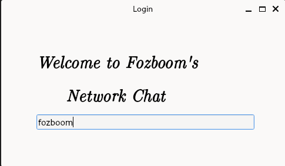
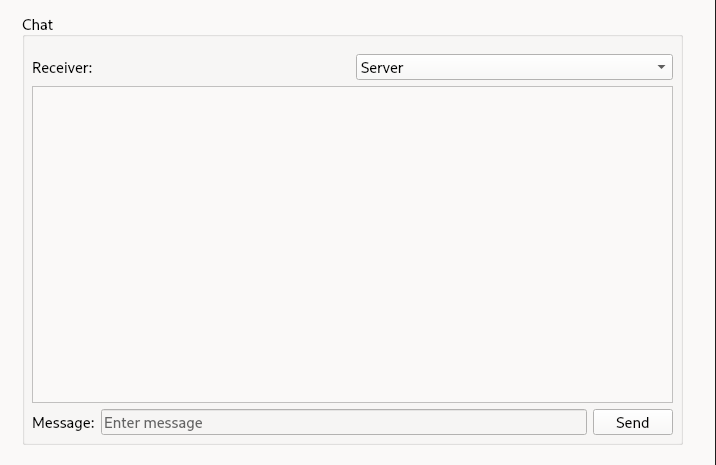
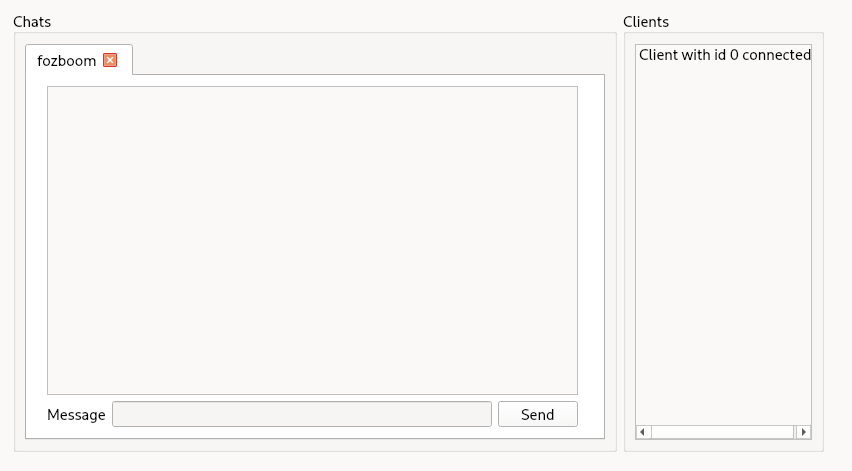

# Qt Network Chat Project

This project is a network chat application developed using C++ and the Qt framework. Despite its apparent simplicity, the process of developing a network chat requires certain skills such as event handling, working with graphics and user interfaces, implementing network logic, and using algorithms and data structures.

## Features

- Support for multiple client connections.
- Real-time message exchange.
- Display of client connection status.
- Ability to disconnect clients from the server.
- Database that stores the names of connected clients. Clients enter their nickname before connecting to the server.
- Indicators showing when someone is typing.

## Screenshots

### Authorization



### Client



### Server



## Running the Client Application

Special folders with all necessary libraries for running the client on Linux and Windows have been created. To run the client application, simply open the appropriate folder for your operating system and run the executable file. The client will connect to my server.

- For Windows: [Windows Folder](./windows-run). Run `Client.exe`.
- For Linux: [Linux Folder](./linux-run). Run `AppRun`.

## Building and Running Your Own Server and Client

You will need Qt 6 or newer and a C++ compiler that supports C++11 to build and run your own server and client.

1. Clone the repository:

```bash
git clone https://github.com/yourusername/qt-chat-server.git
```

2. Open the project in Qt Creator.
3. Build the project using Qt Creator.
4. Run the server and client through Qt Creator.
5. Clients can exchange messages by entering them in the text field and pressing the send button.


## Developer Contacts

For any questions or suggestions, please contact the developer at <fozboom@gmail.com>.

## License

This project is licensed under the MIT License - see the LICENSE.md file for details.
